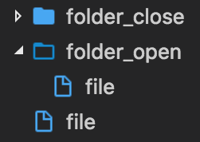

# VSCode Simpler Icons with angular icons

A simpler icon pack than the big pack of icons vscode-great-icons.
Personnal icon theme, to group javascript style (typescript, coffee...) into one only icon, css style (less, sass ...) into on only icon etc ...

fork from https://github.com/EmmanuelBeziat/vscode-great-icons

## Preview

Here is Angular work directory preview :

& more other icons :

(next preview may not be up to date)

## How to use

After installation and activation, you should go in settings (`File` → `Preferences` on Windows, or `Code` → `Preferences` on OSX), choose `File Icon Theme`, and select `VSCode Great Icons`.

