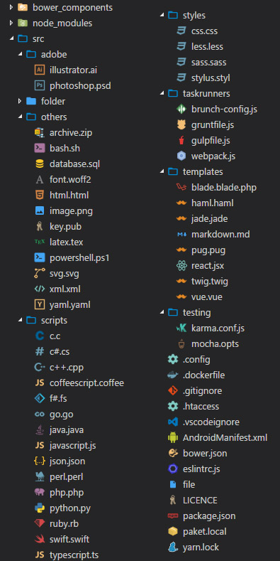

# VSCode Great Icons

 

A big pack of icons (100+) for your files.

(This image is non-exhaustive)

Enjoy ☺

> Wow, we reached 132k downloads… You’ve made my little set one of the most used by VSC community (well, really far behind the first, but still!). Thanks for your support! You’re amazing. ♥

## How to use

After installation and activation, you should go in settings (`File` → `Preferences` on Windows, or `Code` → `Preferences` on OSX), choose `File Icon Theme`, and select `VSCode Great Icons`.

## Want more?

I can add more icons if you need, [open a **new** issue](https://github.com/EmmanuelBeziat/vscode-great-icons/issues) to ask which extension you want.

## Changelog

### v1.1.47 (2017.03.28)

- Added support for MJML templating (`*.mjml`)

[See full changelog here](https://github.com/EmmanuelBeziat/vscode-great-icons/blob/master/CHANGELOG.md)

## Sources

Most of these icons come from
* [Material Icon Theme](https://github.com/PKief/vscode-extension-material-icon-theme)
* [Material Theme](https://github.com/equinusocio/material-theme)
* [VSCode icons](https://github.com/robertohuertasm/vscode-icons)
* Various official icons

## Follow me

* [Twitter](https://twitter.com/EmmanuelBeziat)
* [GitHub](https://github.com/EmmanuelBeziat)
* [CodePen](http://codepen.io/EmmanuelBeziat)
* [Site](https://www.emmanuelbeziat.com)(fr)